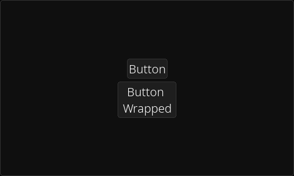

[<- back to elements](../elements.md)

# Button

An interactive element that can contain a text or a surface.

To enable text wrapping set `auto_resize_h` to False.

You can change the text/surface anchoring with the `inner_anchor` setting.

You can modify text or surface wither with the `text` / `surface` settings but also with the properties of the same name.
