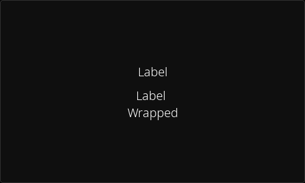

[<- back to elements](../elements.md)

# Label

Element displaying text. Not interactive by default, changing those settings will convert it to a button. The background and the outline are removed by default.

Change the `inner_anchor` setting to decide where the text will be anchored to.

To enable text wrapping set the `auto_resize_h` to False.

You can change or get the text with the `text` setting or `text` property.
