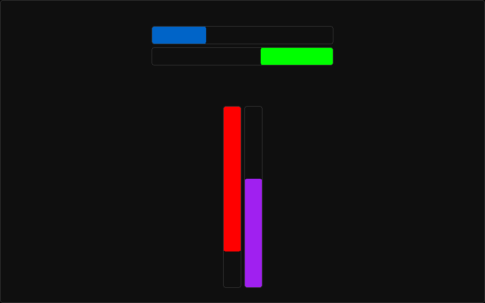

[<- back to elements](../elements.md)

# Progress Bar

Customizable element with a bar inside, usable for health bar of games for example.

The color for the bar is the `inner_color` setting.

The bar can go in any direction between:

- "left-right"
- "right-left"
- "top-bottom"
- "bottom-top"

The following are both settings and attributes you can get and modify:

- min_value
- max_value
- value
- value_percent (override value and is 0-100)
