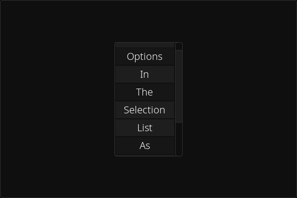

[<- back to elements](../elements.md)

# Selection List

## inherit VCont

An element containing some options the user can select.

You can customize whether the user can select one of more options with the `multi_select` setting. 
WARNING: if `multi_select` is enabled you can only access some methods, same thing if it's disabled.

When the user select a new option the `on_select` callback is called. It is passed a string or a list of strings depending on the `multi_select` flag

You can modify the following settings:

- options
- selected_option (only when multi_select is off)
- selected_options (only when multi_select is on)
- multi_select

## get_selection() -> str

Only if multi_select is off 
Return the current selection

## get_multi_selection() -> list[str]

Only if multi_select is on 
Return the current selected options as a list

## apply_settings_to_options(\*\*kwargs)

This method will pass the kwargs settings to each option button, this way you can customize them easly.
