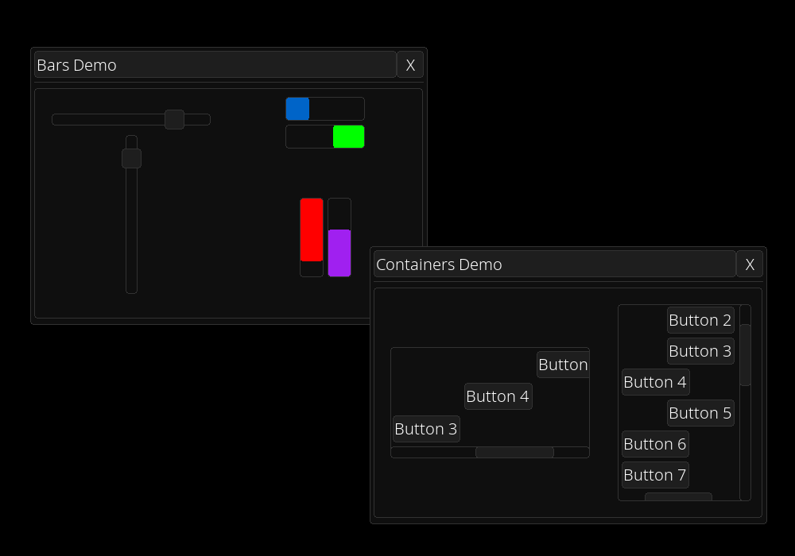

[<- back to elements](../elements.md)

# Window

## inherit VCont

A movable window with a title bar with a close button. 
WARNING: The window needs to be a tree element, so it can't have a parent.

When you use the `with` statement elements will be added to the inner container automatically.

When the close button is clicked the `on_close` callback is called and the window is hidden.

You can modify this settings:

- title
- topleft
- can_drag
- on_close - callback

Additionally you can access its components using the following properties:

- title_button
- close_button
- inner_container
- line_separator
