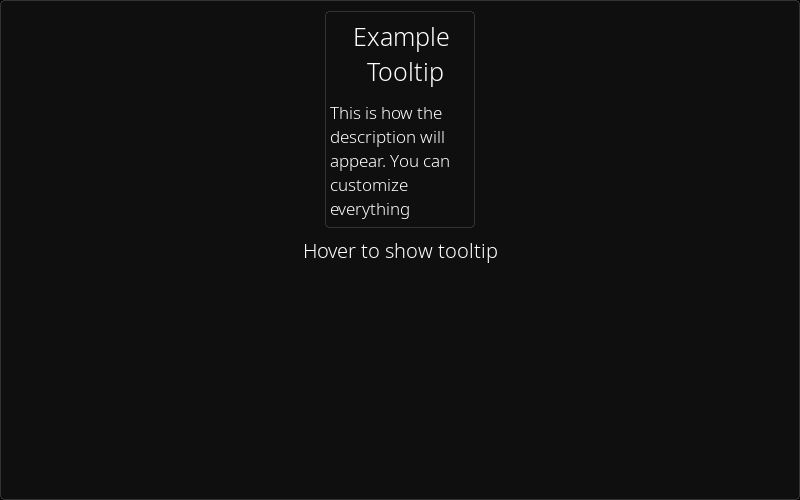
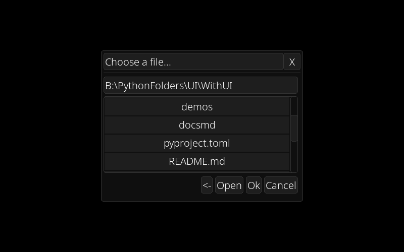

[<- back to docs](docs.md)

# Extension Module

This module contains quality of life features that are wrappers of WithUI elements useful for quicker development.<br>
Using it is as easy as accessing it from the main WithUI module:

```py
import withui as wui

wui.ext. # the thing you need
```

# Tooltip Manager

A class to easly create tooltips that will appear when hovering some elements. <br>

### Creating an instance

```py
import withui

tt_manager = withui.ext.TooltipManager(
    150, # width
    800, # default ms after which the tooltip will appear
    )
# both parameters have a default value
```

### Registering a tooltip

```py
# I assume you created an instance of TooltipManager

button = withui.Button(text="Example Element")
tt_manager.register_tooltip(button, "Title of the tooltip", "Description of the tooltip") # this button will now have a tooltip on hover
# you can pass an additional parameter which is the hover after time, if the default value is not good in that situation
```

### Updating tooltips

```py
while True:
    # ...
    tt_manager.update()
    # ...
```

### Extra

You can also manually customize tooltip components using the following properties

- tooltip_container (VCont)
- tooltip_title (Label)
- tooltip_description (Label)



# Animations Manager

A static class holding references to the two types of animations that I'll show below, that can update them all at once. You can still update them manually if you prefer.

```py
dt = 1
while True:
    # ...
    withui.ext.AnimationsManager.update(dt)
    # ...
    dt = clock.tick(60) * 0.001 # important for it to be in seconds!
    # ...
```

# Typing Animation

Bound to an element supporting text (Button, Label, Entryline) shows characters in quick succession and makes pauses at breakpoints. You can call the `update()` method manually or use the AnimationsManager update. For this animation delta time is not needed.

### Registering the animation

```py
label = wui.Label()
withui.ext.TypingAnimation(label, "This text will appear animated!")
# the other parameters describe animation speeds for different character types. "dot" includes .,!,?
```

### start()

Reset the text and start animating

### finish()

Manually terminate the animation

### text property

Get and set the animation text

## Grow on Hover Animation

Bound to any element, makes the background image grow and shrink when hovering. Only intended for elements with a background image. Same updating applies like the typing animation but delta time is required.

```py
element = withui.Button(bakground_image=my_image, width=100, height=100)
withui.ext.HoverGrowAnimation(element, my_image)
# grow_factor: how much the image grows when hovered
# speed: how quicly the image reaches the max size
```

The `background_image` is available as a property (get and set) among with the `current_image` (get)

# File Dialog

Wraps a window representing a file dialog. Create a new instance every time you need the dialog as when the window is closed, the instance is deleted.<br>
Constructor parameters:

- `topleft`: topleft position of the window
- `width`: width of the window
- `height`: height of the window
- `title` (optional): the window title
- `on_close` (optional): Callback called when the window is closed
- `on_cancel` (optional): Callback called when the cancel button is pressed
- `on_ok` (optional): Callback called when the user presses ok or when a file is inputted in the path entry line
- `start_path` (optional): The first path shown. Default is the current working directory
- `allow_folders` (optional): Whether the user can select a folder and press ok
- `filter_extensions` (optional): If a value (list of strings) is given, only files with those extensions can be selected

### open_path property (get, set)

The folder currently opened in the file dialog

### selected_path property

The absolute path of the user selection if any, otherwise the current opened path


