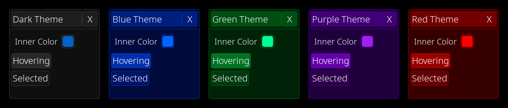

[<- back to docs](docs.md)

# Themes

WithUI comes with a few builtin themes that are contained in the `Themes` static class.

You can set a theme as default or apply its settings to some elements only.

## Available themes

- Red
- Green
- Blue
- Purple
- Dark/Black
- Light/White - This theme sucks. Make your own if you really need it



## Usage

```py
# DEFAULT THEME
withui.Themes.set_default("green") # you can use any capitalization
# same as
withui.Themes.set_default(withui.Themes.GREEN)

# OBJECT SPECIFIC THEME
# don't forget the unpack operator!
withui.Button(text="A Button", **withui.Themes.BLUE)
```

## [-> next (keyboard navigation)](navigation.md)
